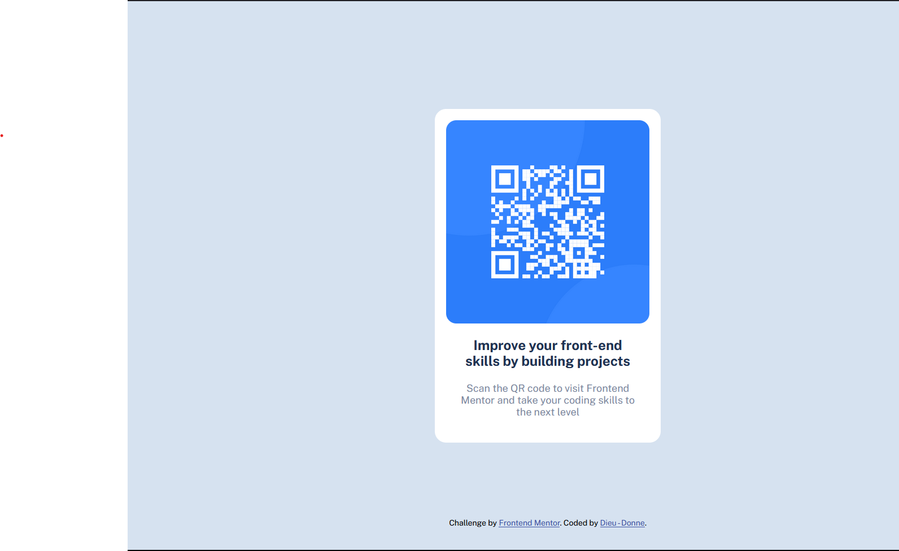

# Frontend Mentor - QR code component solution

This is a solution to the [QR code component challenge on Frontend Mentor](https://www.frontendmentor.io/challenges/qr-code-component-iux_sIO_H). Frontend Mentor challenges help you improve your coding skills by building realistic projects. 

## Table of contents

- [Overview](#overview)
  - [Screenshot](#screenshot)
  - [Links](#links)
  - [Built with](#built-with)
  - [What I learned](#what-i-learned)
  - [Useful resources](#useful-resources)
- [Author](#author)

## Overview
My first Frontend mentor challenge. It's a fairly simple project and I wil be doing more.
### Screenshot

### Links

- Solution URL: (https://github.com/d-donne/qr-code-component.git)
- Live Site URL: (https://your-live-site-url.com)

### Built with

- Semantic HTML5 markup
- CSS custom properties
- Flexbox
- Mobile-first workflow

### What I learned

"Internet is for everyone, but it won't be unless WE make it so." - Vint Cerf, 7. April 1999
### Useful resources

- [w3schools - Accessibility Guidelines course](https://www.w3schools.com/accessibility/index.php)
Explains importance of web content accessibility and emphasizes the need for appropriate HTML5 Semantic Elements and/or the 'role' attribute in web development.

## Author

- Frontend Mentor - [Dieu - Donne](https://www.frontendmentor.io/profile/d-donne)
- Github - [@d-donne](https://github.com/d-donne)

